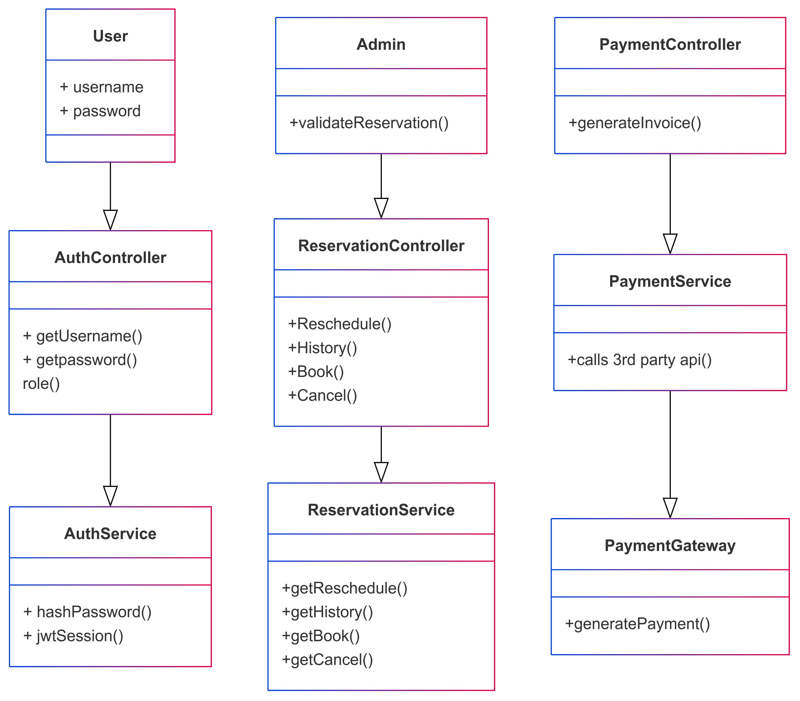

## medpoint
This is a C4 model for medpoint system, generated by [supagen](https://github.com/supagen/supagen).

## How to run
1. Clone the project
2. Run `make run` to run the project
3. Access the C4 diagram at http://localhost:8085

## C4
C4 code diagram
